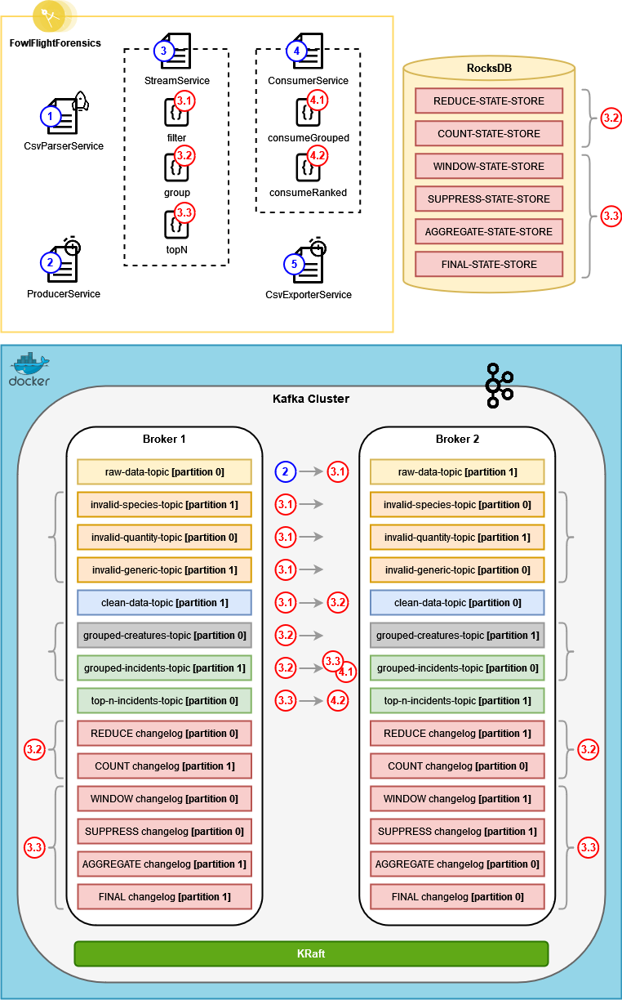

# FowlFlightForensics
A Kafka-based CSV processor for bird-related airplane accidents

> [!WARNING]
> This project was created with the purpose of exploring various different scenarios related to Kafka. It should not be
> considered production-level by any means. The structure has been purposefully put together in a way that is very far
> from "the Kafka way", just to see what would happen and learn from the result.
> 
> Tests have also just been added as samples to indicate parts of the code that would normally need testing. The tests
> themselves need a lot of work to be considered complete (including mocking secondary objects). This will probably be done
> at some point in the future.

## Description
This is a project created using **Java 22** and **Spring Boot 3.2.5**, which aims to parse a CSV file, process it within
a Kafka cluster and produce an output CSV. The input CSV file contains detailed information about aircraft accidents caused
by various wildlife species, including the type of damage that was caused and the number of creatures that caused the incident.

### Topology


### Data Preparation
The original dataset contained a lot of invalid data which had to be cleaned up in order for any sort of calculations to be
possible. Since most of that information couldn't be deduced (and performing imputations wasn't part of the objective),
the following steps were taken:
1. A somewhat rough data analysis process was performed on the contents of the original CSV file, to determine which values
   could be considered valid and which not.
2. A set of rules that reflected these observations was created and added to a Map (see `validationRules` in `IncidentValidator`).
3. The contents of the input CSV were evaluated using the rules mentioned above. This was done using Java code, on
   application startup. 
4. The total amount of issues found per rule was calculated in the Java code, and compared to the total size of the dataset.
5. If the application of a specific rule identified fewer than 3% of the dataset's total entries as invalid, then the metric
   that the rule in question was validating was selected as "valid enough" to be a potential candidate to be used for statistics
   calculation.
6. The metrics that were selected for statistics calculation are the same metrics on which validations will be applied
   (to ensure that the end results will eventually make sense). The rest of the metrics will simply be ignored.

### Data Pipeline

In general, what happens to the data during each execution is pretty straightforward:
1. The CSV file gets loaded and parsed into a List of `IncidentDetails` objects.
2. The objects are validated based on a predefined set of rules and the total percentage of invalid objects is calculated
   based on each rule.
3. Rules with an invalid object frequency under 3% are selected to be applied later.
4. The `IncidentDetails` objects are transformed to `IncidentSummary` objects, by removing most of their fields and keeping
   only fields of interest.
5. Each object is sent to the `raw-data-topic`, using a Kafka **Producer**. Each message is formatted as a pair of `IncidentKey`
   and `IncidentSummary`.
6. The selected rules from step **(3)** are applied to all messages in that topic, using **KStreams**. Invalid messages are
   forwarded to either `invalid-species-topic`, `invalid-quantity-topic` or `invalid-generic-topic`.
7. The messages that are still considered valid after the application of the selected rules, are sent to `clean-data-topic`. 
8. The messages from step **(7)** are grouped and aggregated in two separate ways, using **KStreams**:
   - By calculating the sum of average _creature_ counts, which provides a rough estimation of how many creatures in total
     caused aircraft accidents per **year**, **month** and **species**. The results of this calculation are sent to `grouped-creatures-topic`.
   - By calculating the total number of _incidents_, which describes how many incidents each **species** caused per **year** and
     **month** combination. The results of this calculation are sent to `grouped-incidents-topic`.
9. **Grouped incidents** are then received by:
   - A separate Kafka **Consumer**, which calculates the **top N species** that caused the most incidents within a single
     **year** (where **N** is a configurable number). The results of this process are exported to `data/output_java.csv`.
   - Another **KStream** which calculates the **top N species** that caused the most incidents within a single year (where
     N is a configurable number), utilizing windowed aggregations. The results of this process are sent to `top-n-incidents-topic`. 
10. A Kafka **Consumer** reads messages from `top-n-incidents-topic` and directly exports them to `data/output_kafka.csv`,
    without performing any further calculations.

The two output CSV files both have the same structure, so they are directly comparable.

### Caveats
To make the application's execution easier, certain choices were made that don't align with Kafka best practices. These choices
were made consciously, since the project itself is more of an exploration into what Kafka has to offer, instead of actual
production-level code. Some examples of this are the following:
- Each new execution of the code runs from scratch, without reusing any results of previous executions. To achieve this,
  the following things are done:
  - The local state store (the folder of which has been conveniently moved under the project's root directory) gets deleted
    on application start up, by `DataWiperService`.
  - All connected topics and partitions are completely emptied of messages (on application start up, by `DataWiperService`).
  - Each time aggregations are performed and using the state store is necessary, a new store name is generated using a UUID,
    so that aggregations from previous runs aren't taken into account. Even though this is obviously not a good practice,
    it was done because there were permissions issues when attempting to delete data from the state store.
- The entire pipeline is packaged in one single application. In a production environment, this code would probably be built
  as a set of microservices, so that the appropriate resources can be dedicated to each part of the stream. In this case,
  the goal was for anyone attempting to run the application to only need to run it once without being concerned with whether
  there should be multiple run configurations and in which order each service should be called.
- The stream to process gets created from a CSV file and the output gets written in two CSV files. Both files are expected
  to have the same contents after the program's execution. This doesn't make much sense from a Kafka perspective, since in
  a real-world scenario we would have a steady stream of information being processed, and thus there would be no "eventual
  state" to check for in the output files (either both files would be continuously changing, or there would be no files at
  all and the data would be presented in a UI via something like WebSockets).
- The application exits after the input dataset gets successfully processed. In an actual streaming application we wouldn't
  want this to happen, since we wouldn't know if and how soon the next set of data points would arrive.
- The CSV that is directly exported from `top-n-incidents-topic` usually doesn't contain the last year of data, and the
  data of the year before that may also be incomplete. That is because the application is built to run once and stop, so
  the last batches of data are never flushed from the window state store. Window size has been selected in such a way that
  this effect is minimized while simultaneously ensuring maximum accuracy for the completed calculations. In general, smaller
  windows resulted to more data being processed until the execution stops, but there was the chance that some messages might
  be added twice to the total, since by only grouping the messages per year and species there was no easy way to figure out
  which month each incident count originated from, unless the transferred objects were made more complicated. This wasn't
  attempted because it would defeat the purpose of trying to perform these aggregations using "the Kafka way". In a production
  environment, assuming the window size was also correctly selected, the discrepancy in the calculated data wouldn't be
  noticeable, because a steady stream of information would be available, and thus eventual consistency would be guaranteed.
  There was a way to _kind of_ bypass this issue, by not using a UUID in the `SUPPRESS-STATE-STORE`, because this would
  result to the correct data being displayed after the second execution (since we always have the same input and thus the
  same output, so any leftovers from the previous execution would be used after the program started again). This could be
  considered "cheating", so I didn't choose to implement this logic.
- The comparison between the two output CSVs might result in other minor discrepancies at times (e.g. two species appearing
  in a different order between the CSVs or the last species within a year being different). This is because some species
  may share the same count of incidents within the same year. There was obviously the option of sorting the values within
  a year using both count and species, but this was considered minor enough since the correctness of the results had already
  been validated, and thus it has been left as is.

## Environment Setup
### Requirements
To successfully set up and run the project on a Windows machine, you first need the following things installed:
- [WSL/WSL2](https://learn.microsoft.com/en-us/windows/wsl/install)
- [Docker Desktop](https://docs.docker.com/desktop/install/windows-install/)

### Instructions
- In Docker Desktop, search for **apache/kafka** and pull version [3.7.0](https://hub.docker.com/layers/apache/kafka/3.7.0/images/sha256-3e324d2bd331570676436b24f625e5dcf1facdfbd62efcffabc6b69b1abc13cc).
- **Run** the image to create a container named ApacheKafka.
- **Start** the container and execute the following commands in its terminal to retrieve its cluster id:
  ```bash
  cd opt/kafka/bin
  ./kafka-metadata-quorum.sh --bootstrap-server localhost:9092 describe --status
  ```
- Open **PowerShell**, go to the **docker** folder found in your project directory, and execute the following command
  to create a new docker image, based on **apache/kafka:3.7.0** (using the cluster id from the previous result):
  ```bash
  docker build --build-arg CLUSTER_ID=5L6g3nShT-eMCtK--X86sw -t kraft-kafka -f Dockerfile .
  ```
- Run **docker-compose.yml** from the IntelliJ UI to create and start the containers that will host your topics.

### Executing Manual Commands
You can execute manual commands from outside your newly created cluster.
To do this, you can execute the following commands in the WSL terminal:
- To install Java 21:
  ```bash
  sudo apt install openjdk-21-jdk
  ```
- To download and unzip KRaft Kafka:
  ```bash
  wget https://archive.apache.org/dist/kafka/3.7.0/kafka_2.13-3.7.0.tgz
  tar -xvzf kafka_2.13-3.7.0.tgz
  ```
- To use the shell scripts included in the Kafka installation:
  
  **List available cluster members**
  ```bash
  cd kafka_2.13-3.7.0/bin
  ./kafka-broker-api-versions.sh --bootstrap-server localhost:19092 | awk '/id/{print $1}' | sort
  ```
  **List all topics**
  ```bash
  cd kafka_2.13-3.7.0/bin
  ./kafka-topics.sh --list --bootstrap-server localhost:19092, localhost:29092
  ```
  **Start a consumer on a specific topic**
  ```bash
  cd kafka_2.13-3.7.0/bin
  ./kafka-console-consumer.sh --bootstrap-server localhost:19092, localhost:29092 --topic raw-data-topic --from-beginning
  ```
  **Delete a topic**
  ```bash
  cd kafka_2.13-3.7.0/bin
  ./kafka-topics.sh --bootstrap-server localhost:19092 --topic raw-data-topic --delete
  ```
  **Delete multiple topics**
  ```bash
  cd kafka_2.13-3.7.0/bin
  ./kafka-topics.sh --bootstrap-server localhost:19092, localhost:29092 --delete --topic 'kafka-stream-.*'
  ```

### Configuration
You can run the application using multiple configurations, and it will yield different results per case. By modifying the
following values, you can draw your own conclusions based on the results:
- `FowlFlightForensics.util.Consts`
  - `INVALID_INCIDENTS_FILTER_STRICT`
  
    This changes the strictness of the data validations applied when running the application. There is a strict option, as
    well as a more lenient one, which are defined by the percentage of entries that will end up in the _invalid_ topics if
    each set of validations is applied. The main difference between the two, as far as the end result is concerned, is that
    the strict ruleset will completely remove entries that refer to unknown species, while the more lenient one won't. The
    default value for this setting is `true`.
- `application.properties`
  - `app.result.incidents.per-year.limit`
    
    How many of the top species will be returned per year in the CSV export. The default value for this setting is `5`.
  - `app.result.incidents.distinct.time-window.seconds`
    
    How long the grouped incidents will be suppressed, in order to avoid receiving all counts per group and use only the
    last value within that specific timeframe. Larger windows result to more accuracy but fewer data available after execution.
    Smaller windows result to the opposite. Values between `8` and `40` have been tested and based on that, a default value
    of `12` was selected.
  - `app.producer.send-message.fixed-rate`
    
    How fast the Producer sends messages to the `raw-data-topic`. This can also have an effect on how much data is exported
    to the CSV file until the end of the execution, although not as much as the time window above. Values between `500` and
    `1000` milliseconds have been tested, and the best results seemed to come from setting its default value to `700`.

The configurations mentioned above cannot be considered standalone. In fact, they have been observed to affect and be affected
by each other. The current default values have been selected with the assumption that the strict validation rules will be
used. If you want to change the validation rules to utilize the **non-strict** option, you'll probably have to do something
like the following, to achieve the best results:
```java
public static final boolean INVALID_INCIDENTS_FILTER_STRICT = false;
```
```properties
app.result.incidents.distinct.time-window.seconds=25
app.producer.send-message.fixed-rate=800
```

## Key Takeaways
This was a fun exercise, from which I learned a lot. Some conclusions that can be drawn from its creation are the following:
- Regarding **Kafka**:
  - It is true that a different mindset is needed if you want to utilize Kafka for calculations like the ones mentioned here.
    It is also true that once you realize what the differences are and what tools there are in your toolbox, the underlying
    logic will still be the same. This can become more easily apparent if one compares the **algorithm** (and not the code)
    that is used for the **top N** calculation using either Java code or KStreams (the steps taken are basically the same).
  - Performing stateful operations using KStreams can feel "too fiddly", mostly due to the way you are expected to configure
    the stream. In some cases it might be a better idea to utilize something like Apache Flink, especially if you want to
    have custom windowing criteria.
  - Creating a traditional application (i.e. with a specific start and end) that also happens to utilize Kafka will require
    much more effort than expected, and you may run into unforeseen issues. It still is a good exercise if you want to learn
    more about Kafka, though (it might actually be a better exercise than creating an application that fits better into the
    Kafka use case, because you get to see more edge case scenarios and figure out creative ways to bypass them).
  - If you are using different Key/Value combinations per topic, and you're consuming them from multiple KStreams (instead
    of simply modifying the objects within branches of the original KStream), make sure to declare the exact Serdes to be
    used within each call that supports doing so. This will save you a lot of trouble trying to figure out why the same code
    works within the branch but not in a separate KStream.
- Regarding the **dataset**:
  - Wildlife-related aircraft accidents saw a spike between the late 90's and early 2000's, but they have been declining
    ever since, although not by that much.
  - Our ability to tell which species caused each accident hasn't improved by a lot, over the years.
  - The species that caused the accident is known in only about 52% of the total cases.
  - Each incident can be caused by multiple creatures (ranging from just one to the thousands). The fact that the grouping
    was eventually performed using a count of incidents within a year instead of summing up the creature number per incident
    is because if you want to find the most dangerous species, how many accidents that species caused is a better factor
    to use than the number of creatures per accident.
  - Gulls are a menace. Even when using the less strict validation option, they can still be found within the top species
    to cause accidents per year, even among multiple "UNKNOWN" species entries. When using the more strict validation rules,
    they are almost always first on the list.